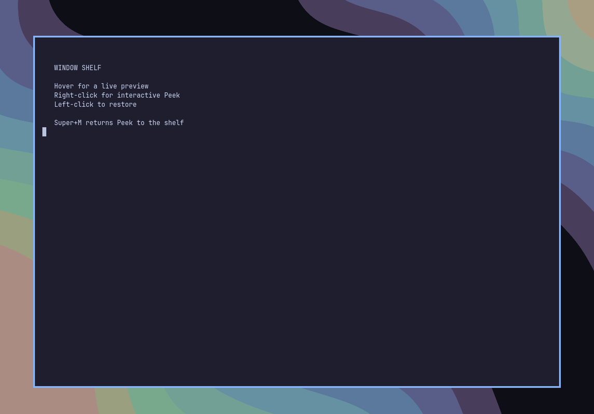
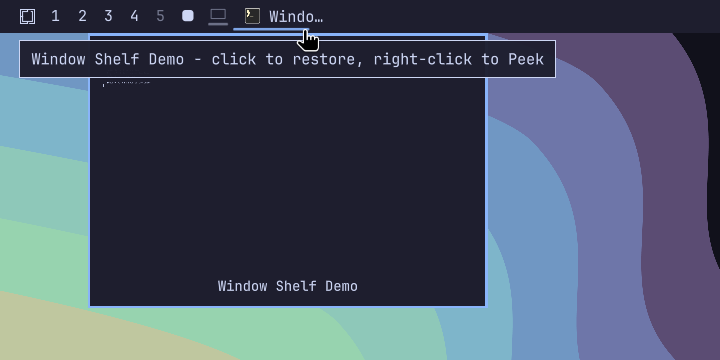

# Omarchy Minimize

Minimize Hyprland windows into compact, clickable title chips in the Omarchy
bar. Clicking a chip restores that exact window onto the workspace you are
currently viewing.

Hyprland does not provide conventional desktop minimization. Omarchy Minimize
implements the behavior by parking windows on the private
`special:minimized` workspace and using Hyprland's window addresses to
restore the correct client.



## Features

- Adds a mouse-accessible minimize button to the Omarchy bar
- Shows every minimized window as an individual application icon and title chip
- Displays a live, non-interactive window preview after hovering a chip briefly
- Opens the real window as a centered, interactive Peek on right-click
- Restores a window onto the currently focused workspace
- Tracks windows reactively through Quickshell without polling
- Reconstructs its state after shell restarts from the Hyprland workspace
- Supports horizontal and vertical Omarchy bars
- Uses the active Omarchy theme, spacing, typography, and tooltips
- Stores no separate state and starts no background processes

## Requirements

- Omarchy with the Quattro shell plugin system
- Hyprland running in Lua configuration mode
- Quickshell `0.3.0` or newer

## Install

Review the source before installing. Omarchy plugins run as unsandboxed code
inside the long-running shell process.

```bash
omarchy plugin add https://github.com/gardnmi/omarchy-minimize.git --enable
```

The widget defaults to the left bar section. If you installed it without
`--enable`, enable it later with:

```bash
omarchy plugin enable io.github.gardnmi.window-shelf --section left
```

### Quick Start

The plugin works immediately with the mouse: click the minimize glyph to send
the active window to the shelf. Click the shelf glyph to open live thumbnails
of parked windows, then click a thumbnail to restore that window.

For keyboard control, first confirm `SUPER + M` is not already assigned:

```bash
omarchy menu keybindings --print
```

Then add this optional binding to `~/.config/hypr/bindings.lua`:

```lua
o.bind("SUPER + M", "Minimize window", hl.dsp.window.move({
  workspace = "special:minimized",
  follow = false,
}))
```

Apply and validate the change:

```bash
hyprctl reload
hyprctl configerrors
```

If `SUPER + M` is already assigned, choose another unused key instead of
silently replacing its existing action. Installing Omarchy Minimize never
modifies Hyprland bindings automatically.

## Use

| Input | Action |
| --- | --- |
| Left click the minimize glyph | Minimize the active window |
| Left click the shelf glyph | Open or close live thumbnails of minimized windows |
| Left click a thumbnail | Restore that window on the current workspace |
| Left click a title chip | Restore that window on the current workspace |
| Hover a title chip | Show a live preview and the complete window title |
| Right-click a title chip | Open or close a centered, interactive Peek |
| `SUPER + M` from Peek | Return the window to the shelf and restore its layout state |



The window list is global. On a multi-monitor setup, every live bar instance
reflects windows parked on the shelf, and restoring uses the workspace focused
at the time of the click.

Interactive Peek temporarily moves one exact client onto
`special:omarchy-window-peek`, floats it at the configured size, and centers it
over the current workspace. It is the real application window, so pointer and
keyboard input work normally after you click it. Right-click its chip again or
press `SUPER + M` while the Peek window is active to return it to the shelf.
Switching normal workspaces also dismisses Peek. Left-click the chip while Peek
is open to restore it permanently. Tiled windows return to tiled state;
previously floating windows recover their prior size and position.

### Configuration

Set `showWindowChips` to `false` to show only the shelf glyph and its thumbnail
chooser. Title chips default to 18 characters. Set `maxTitleLength` on the bar entry to
change the limit. `maxChipWidth` controls the rendered chip width and
`previewDelay` controls the hover delay in milliseconds. `peekWidth` and
`peekHeight` control the centered interactive window size:

```json
{
  "id": "io.github.gardnmi.window-shelf",
  "showWindowChips": false,
  "maxTitleLength": 24,
  "maxChipWidth": 220,
  "previewDelay": 350,
  "peekWidth": 960,
  "peekHeight": 640
}
```

## Update

```bash
omarchy plugin update io.github.gardnmi.window-shelf
```

Omarchy rescans plugins after an update; a shell restart is not normally
needed.

## Remove

Restore any windows you still need before removing the plugin, then run:

```bash
omarchy plugin remove io.github.gardnmi.window-shelf
```

Removing the plugin does not close parked applications or move them out of the
special workspace. If the plugin is unavailable while windows remain parked,
reveal the shelf with:

```bash
hyprctl dispatch 'hl.dsp.workspace.toggle_special("minimized")'
```

Move or close those windows normally before hiding the special workspace again.

## Data And Privacy

- The plugin reads Quickshell's in-process Hyprland toplevel and workspace
  models, including window addresses, application IDs, and titles.
- While a chip is hovered, Quickshell requests a local live compositor export
  of that exact window to render its preview. The frame remains in the shell
  process and is discarded when the preview closes.
- Minimizing, restoring, and interactive Peek issue only local Hyprland Lua
  dispatchers. Peek temporarily changes the exact client's workspace, floating
  state, size, and position, then restores its prior layout state when closed.
- Desktop-entry metadata and icons are resolved from the local application
  database and icon theme.
- The plugin does not save screenshots, access application files, use the
  network, execute a shell, or persist state.
- Window titles are rendered locally in the bar and may contain application or
  document names supplied by those applications.

## Troubleshooting

### The widget does not appear

Confirm Omarchy discovered and enabled it:

```bash
omarchy plugin list
omarchy plugin enable io.github.gardnmi.window-shelf --section left
omarchy-shell shell rescanPlugins
```

### A window is still hidden

Show the private special workspace:

```bash
hyprctl dispatch 'hl.dsp.workspace.toggle_special("minimized")'
```

If the window appears there, move it to a normal workspace or restore it after
reenabling Omarchy Minimize.

### The keyboard shortcut does nothing

Confirm the binding exists and Hyprland has no configuration errors:

```bash
omarchy menu keybindings --print
hyprctl configerrors
```

## Development

Deploy the complete working tree while Quickshell is stopped, then restart it:

```bash
mise run restart
```

This replaces the installed local plugin copy. Keep repository work in this
directory rather than editing `~/.config/omarchy/plugins/` directly.

Validate the repository with:

```bash
omarchy plugin validate .
qmllint -I /usr/share/omarchy/shell BarWidget.qml
bash -n deploy-local.sh
mise run test
git diff --check
```

## License

Omarchy Minimize is licensed under the [MIT License](LICENSE).
